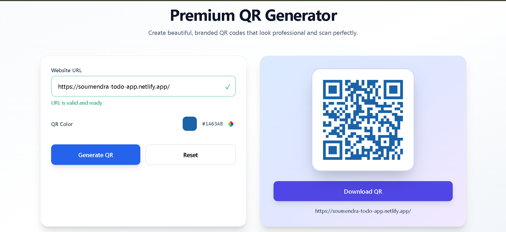

# 🔳 Premium QR Code Generator (React)

A modern, premium-looking **QR Code Generator** built with **React** that allows users to generate beautiful, branded QR codes for any website URL.  
The application validates URLs, supports custom QR colors, embeds a logo inside the QR, and allows users to download the QR code as an image.

---

## 🚀 Features

- ✅ Real-time URL validation  
- ✅ Automatically adds `https://` if missing  
- ✅ High-quality QR code generation  
- ✅ Custom QR color picker  
- ✅ Logo embedded inside QR code  
- ✅ Download QR code as PNG  
- ✅ Clean & premium UI  
- ✅ Fully responsive design  

---

## 🛠️ Tech Stack

- **React** (Hooks: `useState`, `useRef`)
- **qrcode.react**
- **Tailwind CSS**
- **JavaScript (ES6+)**

---

## 📸 Preview

> Premium UI with live QR preview and instant download  

<p align="center">
  
</p>

---

## ⚙️ Installation & Setup

Follow the steps below to run this project locally:

### 1️⃣ Clone the Repository

git clone git clone https://github.com/Soumendra02/qr-generator.git

### 2️⃣ Navigate to Project Directory
cd qr-code-generator

### 3️⃣ Install Dependencies
npm install

### 4️⃣ Start Development Server
npm run dev

---


## 📂 Project Structure

````text
QR_Code-Generator/
├── index.html
│
├── public/
│   ├── logo.jpg
│   └── preview.png
│
├── src/
│   ├── components/
│   │   └── QRGenerator.jsx
│   │
│   ├── App.jsx
│   ├── main.jsx
│   └── index.css
│
├── .gitignore
├── eslint.config.js
├── package.json
├── package-lock.json
├── postcss.config.js
├── tailwind.config.js
├── vite.config.js
└── README.md


---

The app will run on:

http://localhost:5173

📦 Required Dependency
npm install qrcode.react